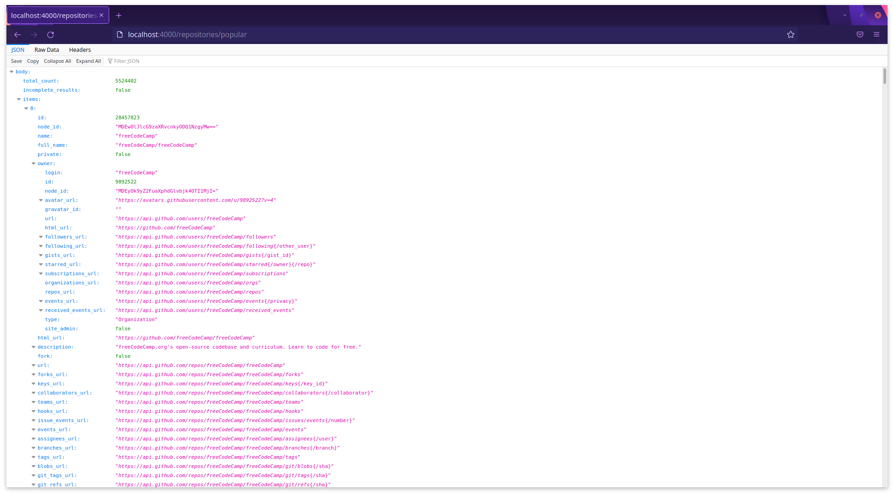

# Getting Started with Most Popular Repositories Github

## Available Live Demo API

Click [Here](https://most-popular-repos-ghandour.herokuapp.com/repositories/popular) to View the Production.

Server Link (API) : https://most-popular-repos-ghandour.herokuapp.com/repositories/popular

### example

[](https://most-popular-repos-ghandour.herokuapp.com/repositories/popular)

## Setup

Get the code:

```
git clone https://github.com/MohamedElGhandour/most-popular-repositories-github.git
```

Install dependencies:

```
cd most-popular-repositories-github
npm install
```

compile typescript to javascript:

```
npm run build
```

Run the server:

```
npm start
```

Run the server (dev mode):

```
npm run dev
```

Point a web browser at the demo:

```
http://localhost:4000
```

## Routes

### repositories Routes

```
GET         /repositories/popular
```

### Filter

Use `language` and `created_after` to filter returned data.

```
GET /repositories/popular?language=typescript
GET /repositories/popular?created_after=2020-10-10
```

### Paginate

Use `limit` and `skip` to paginate returned data.

```
GET /repositories/popular?skip=7
GET /repositories/popular?skip=7&limit=50
```

_10 items are returned by default_
